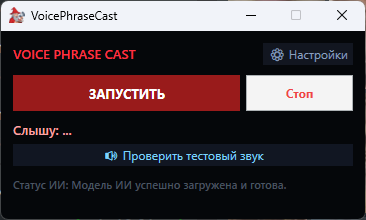
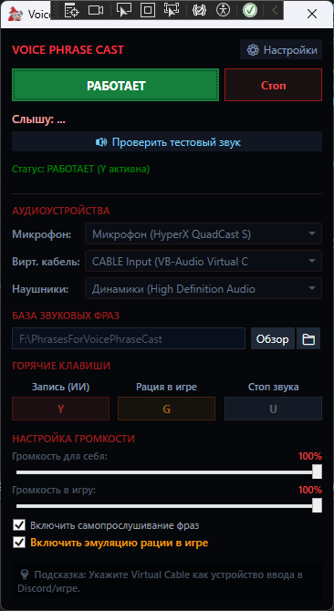
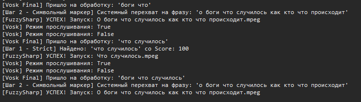

# VoicePhraseCast 🎙️🎮

**VoicePhraseCast** — це десктопний додаток на WPF (.NET), призначений для автоматичного відтворення аудіофрагментів (голосових реплік персонажів, звуків, музики, то що) у голосовий чат (гри, соцмережі (накшталт Discord)) на основі розпізнавання мовлення користувача в реальному часі.

Проєкт розроблений в першу чергу для інтеграції з Dota 2. Він дозволяє гравцям відтворювати атмосферні, пафосні або кумедні репліки героїв (наприклад, Arc Warden, Ogre Magi, MonkeyKing) прямо в рацію внутрішньоігрового чату, просто вимовляючи їх голосом у мікрофон.

---

## 🔥 Ключові фічі

* **Локальне розпізнавання мовлення:** Використання рушія **Vosk AI** дозволяє розпізнавати голос повністю автономно, без затримок та відправки даних на зовнішні сервери.
* **Розумний нечіткий пошук (Fuzzy Matching):** Завдяки бібліотеці **FuzzySharp**, програма розуміє користувача з пів слова. Вона прощає помилки розпізнавання, кашель або фоновий шум, підбираючи найбільш підходящу фразу за відстанню Левенштейна.
* **Динамічне перехоплення пріоритетів:** Пошуковий рушій захищений від конфліктів між короткими та довгими репліками, що містять схожі слова. Наприклад, якщо користувач вимовляє лише частину фрази *"боги, що"*), система аналізує унікальні маркерні слова й автоматично обирає повну репліку Огр-Мага *"О боги, що сталося, де, як, хто..."*, замість того, щоб помилково запустити коротшу фразу Дроу-Рейнджер («Что случилось»), яка просто частково збігається за текстом.
* **Варіативність та антиспам:** Якщо для однієї фрази в базі є кілька аудіофайлів (варіацій інтонації), але підписаних однаково, додаток вибере випадковий. Вбудований фільтр затримки запобігає спаму звуками.
* **Зручне керування процесом:** Інтуїтивний контроль роботи програми за допомогою трьох основних функцій: швидкий запуск прослуховування голосу, активація емуляції мікрофона для трансляції звуку безпосередньо у гру (з можливістю вимкнення емуляції задля примої передачі аудіо у мікрофон), та кнопка миттєвої зупинки відтворення або розпізнавання.

---

## 📸 Скріншоти інтерфейсу

> *Тут ви можете побачити інтерфейс додатка та логіку його роботи в реальному часі.*

### Головне вікно додатка

### Приклад роботи пошукового рушія

*(Рекомендований скріншот: Вікно відладки Visual Studio або елемент виведення логів, де видно рядки: `[Vosk Final]`, `[FuzzySharp] Перехват приоритета!`, `Успех! Запускаем файл...`)*

---

## 🛠️ Стек технологій

* **Платформа:** .NET 10 (WPF) / C#
* **Розпізнавання мовлення:** [Vosk API](https://alphacephei.com/vosk/)
* **Нечіткий пошук рядків:** [FuzzySharp](https://github.com/JakeBayer/FuzzySharp)
* **Аудіорушій (WASAPI / DirectSound):** [NAudio](https://github.com/naudio/NAudio)

---

## 🚀 Архітектура пошукового алгоритму

Обробка мовлення відбувається в чотири етапи для мінімізації помилкових спрацьовувань:
1. **Крок 1 (Strict Match):** Порівняння через `DefaultRatioScorer` для пошуку ідеального посимвольного збігу. Захищає від плутанини коротких слів (наприклад, «та» і «не»).
2. **Крок 2 (Символьний маркер):** Аналіз «плоских» рядків без пробілів. Перехоплює пріоритет на користь довшої репліки, якщо Vosk довільно розрізав або склеїв слова (наприклад, «да но буде» або «зачи няються»).
3. **Крок 3 (Token Set Match):** Аналіз набору слів через `TokenSetScorer`. Додано двосторонній захист за довжиною рядка для блокування гігантських фраз на надто короткі вводи (наприклад, одиночне «що») і навпаки.
4. **Крок 4 (Partial Match):** Відкат на `PartialRatioScorer` для нечіткого пошуку обрубків, якщо Vosk сильно спотворив літери (наприклад, «да ну буде»). Включає пословну верифікацію та сито довжини від випадкових тригерів.

---

---

## 📦 Налаштування та запуск

### Вимоги
1. Встановлена Visual Studio 2022 (з підтримкою останніх .NET SDK).
2. Мікрофон, налаштований у системі за замовчуванням.
3. Віртуальний аудіокабель (VB-Audio Virtual Cable) для перенаправлення звуку з додатка в ігровий симулятор мікрофона (опціонально, для трансляції в гру).

### Інструкція
Заванажте репозиторій та відкрийте рішення у Visual Studio. Встановіть необхідні NuGet пакети (FuzzySharp, NAudio), якщо вони не встановлені, та запустіть проєкт